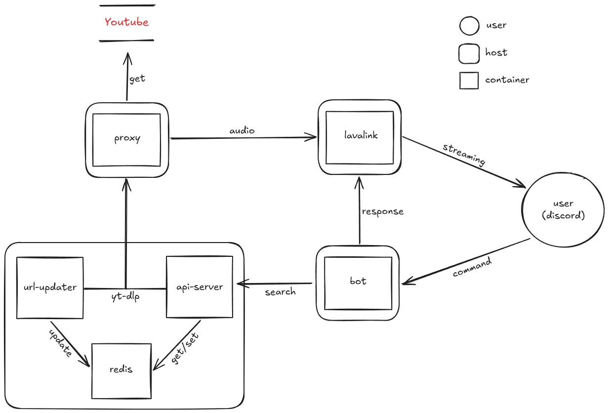
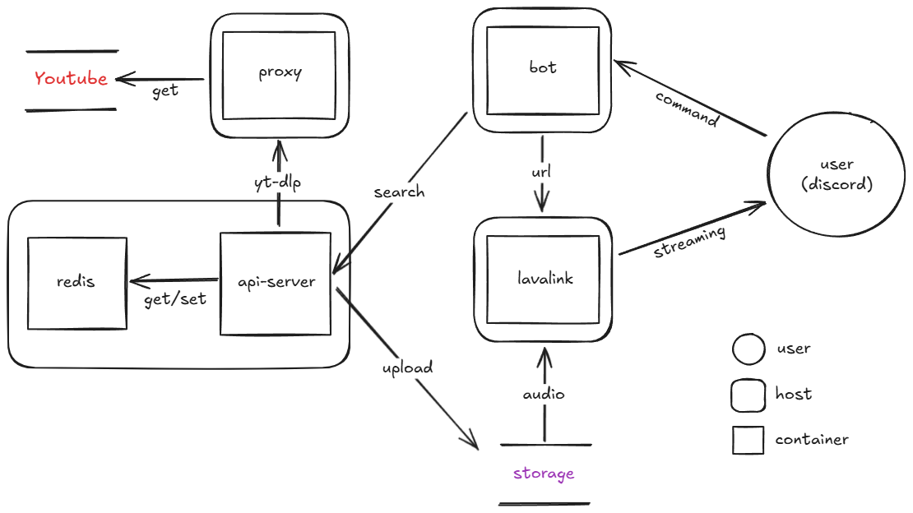

# 시스템 아키텍처 개요

본 프로젝트는 4대의 클라우드 서버로 구성된 분산형 음악 스트리밍 시스템이며, 각 서버는 역할에 따라 명확히 기능이 분리되어 있습니다. 아래는 전체 시스템의 동작 흐름을 시각적으로 표현한 아키텍처 다이어그램입니다.

---

## 구성 요소별 설명

### 🔹 user (discord)
- 디스코드 명령을 통해 봇 서버에 명령 하달
- 음성 채널에 접속된 상태에서 `/play`, `/pause` 등의 명령을 실행

### 🔹 bot
- Discord.py 기반 봇 서버
- 사용자 명령을 해석하고 api-server로 전달
- 재생을 위해 lavalink 노드와 연결 및 상태 유지, url 전달, 노드 제어

### 🔹 api-server
- FastAPI 기반 REST 서버
- Redis에 URL이 있는 경우 즉시 반환, 없을 경우 yt-dlp를 통해 추출 요청

### 🔹 url-updater
- Redis TTL 만료 이벤트를 수신하여 해당 URL을 재추출
- 캐시 갱신을 통해 지속적인 URL 유효성 보장

### 🔹 redis
- URL 캐싱 및 TTL 관리
- PubSub 채널을 통해 TTL 만료 알림 송신

### 🔹 proxy
- NordVPN + nginx (2 컨테이너)

### 🔹 lavalink
- Java 기반 Discord 음악 스트리밍 서버
- 직접 음성 채널로 오디오 데이터를 UDP 방식으로 전송

---

## 처리 흐름 요약

1. 사용자가 디스코드에서 `/play` 명령 실행
2. 봇 서버가 `api-server`로 검색어/ID 전달
3. `api-server`는 `Redis`에서 URL을 조회, 없으면 `yt-dlp`를 통해 `프록시` 경유로 `YouTube`에서 추출
4. 추출된 URL은 `Redis`에 TTL과 함께 저장
5. 봇 서버는 `Lavalink`에 트랙 재생 요청 → Lavalink는 직접 음성 채널로 UDP 스트리밍
6. TTL 만료 시 `Redis`에서 PubSub 이벤트 발생 → `url-updater`가 자동으로 URL 재갱신 수행

---

## 특이사항 및 설계 의도

- 봇 서버는 단순 컨트롤러 역할만 수행, 스트리밍 트래픽은 Lavalink에서 Discord로 직접 전송됨
- 프록시 서버는 YouTube 트래픽 우회 전용으로 독립 구성되어 있음
- URL TTL은 중복 추출 방지 및 캐시 유지를 위한 핵심 설계 요소로 작동

---

## 한계 및 대안

### 한계

- 스트리밍 및 url 갱신을 할 때마다 유튜브 서버에 요청해야함
- 잦은 요청 발생은 IP 차단의 가능성을 높임(봇 활동 차단)
- 유튜브 서버와의 연결 상태에 의존성이 크기 때문에 안정성이 낮음

### 대안

- 스트리밍 방식에서 스토리지 파일 캐싱 방식으로 전환
- url-updater를 포함한 유튜브 서버 요청 대폭 감소
- 스토리지 유지 비용이 기존 외부 트래픽 및 유지보수 비용보다 작을 것으로 전망