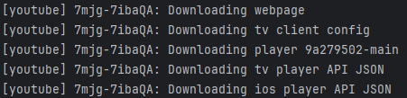
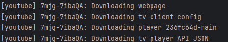

# 문제 해결 사례

## 1. yt-dlp extractor_args 무시 문제
### 문제:
  1. 스트리밍 url을 추출할 클라이언트를 선택하는 방법이 공식 문서에 기재됨
    - `'extractor_args': ['youtube:player_client=tv']`
  2. 공식 문서, 웹 검색, ChatGPT를 활용해도 yt-dlp 모듈 수행에 반영이 안 됨 (web, ios 까지 fallback 시도하는 것을 볼 수 있음)
  - 
### 원인 분석: 두 가지 가능성
  - yt-dlp의 작동 방식이 업데이트 되었으나 패치 노트에 반영되지 않았을 가능성
  - CLI에서의 처리 로직과 Python 라이브러리 호출 간 처리 방식 차이 가능성
### 해결 과정:
  1. yt-dlp는 데이터를 추출하기 전에 각 인자들을 딕셔너리의 키: 값 형태로 받아 로직 결정
  2. 라이브러리의 코드에서 'extractor_args' 인자를 처리하는 함수를 찾음
  3. `./extractor/common.py` 모듈의 `_configuration_arg` 함수에서 사용됨
  4. `extractor_args` 문자열을 입력으로 받는 `traverse_obj` 함수 분석
  5. `traverse_obj`는 다층 키: 값 구조를 안전하게 푸는 함수임을 알게 됨
  6. 따라서, `extractor_args`의 값에 하위 설정들을 키: 값 매핑으로 부여해야 함
### 결과:
  - 추출 시간 단축: **평균 4.5초 -> 3.5초(tv), 2초(android)**
  - 로그 확인 결과 더 이상 불필요한 클라이언트(ios)를 세팅하지 않는 것을 알 수 있음
  - `'extractor_args': {'youtube': {'skip': ['dash', 'translated_subs'],'player_client': ['tv']}}`
  - 

---

## 2. Redis 도입 및 TTL 만료 이벤트 기반 URL 자동 갱신 아키텍처 개선 사례
### 문제: yt-dlp 직접 호출 방식의 한계
  1. yt-dlp가 스트리밍 url을 한번 추출하면 유튜브에 평균 5번의 요청을 보냄(클라이언트마다 다름)
  2. 유저가 `/play` 명령을 한 번 실행할 때마다 최대 8번의 요청을 보냄
  3. **YouTube 차단 리스크**: 단기간의 잦은 요청으로 봇 탐지 리스크가 높음
  4. **요청 지연**: 시간이 오래 걸리므로 유저의 경험이 악화됨
  5. **네트워크 부하**: 네트워크 외부 트래픽 과다 발생

### 개선 방안 설정
#### 캐싱 전략 수립
  - 추출한 url을 캐싱 후 재사용하여 서버 부하 및 네트워크 부하 감소
  - yt-dlp 실행으로 인해 발생하는 YouTube 요청 횟수 대폭 감소
#### TTL 설정 및 url 관리 로직 추가
  - 스트리밍 url은 수 시간 안에 만료됨
  - 사용자 경험 향상을 위해 url이 만료됬을 때 서버 내부에서 자동으로 재발급

### 기술 선택: 왜 Redis인가?
#### 빠른 읽기/쓰기 속도
  - Redis는 디스크가 아닌 메모리를 사용하는 인메모리 DB
  - 사용자의 경험을 향상시키려면 읽기/쓰기 속도가 빨라야 함
#### TTL 지원 및 `Keyspace Notification` 기능 제공
  - 데이터의 Key에 TTL을 부여하여 URL 만료 구현
  - `Keyspace Notification` 기능을 활용하여 `Redis`로부터 실시간으로 키 만료 이벤트 구독

### 데이터 구조 및 프로세스 설계
  - `search:` 사용자의 검색어 -> 영상 ID 매핑을 YouTube 검색 결과 기준으로 저장`(ex: search:hotlesserafim -> cCkAcVOS3ig)`
  - `video:` 영상 ID -> 영상 데이터(url, title, channel, thumbnail)를 저장`(ex: video:cCkAcVOS3ig -> {dict})`
  - video 키에 만료 시간을 부여하여, `Redis PubSub` 기능을 통해 구독한 `__keyevent@X__:expired` 채널로부터 이벤트 수신 및 url-updater 프로세스 실행
### 결과
  - 재생 시간 단축: 첫 재생 **평균 5초 -> 평균 0.7초**(*캐싱된 음원에 한하여*)
  - YouTube API 요청 수 감소: 첫 재생 **평균 6회 ->  1회**(*캐싱된 음원에 한하여*)
  - 서버 부하 감소 및 네트워크 외부 트래픽 감소

---

## 3. YouTube IP 차단 및 프록시 우회
### 문제
  1. 서버에서 YouTube 요청 시 403 오류, `sign in to confirm you're not a bot` 요청 등 발생
  2. yt-dlp를 통한 URL 추출이 정상적으로 이루어지지 않음
  3. 로컬 환경과 UA, Header 등의 요소가 같지만, 클라우드 서버에서만 실행되지 않음
### 원인 추측
  1. 클라우드 인프라 서버의 IP는 YouTube 측에서 집중 모니터링함
  2. IP, TLS handshake 패턴, HTTP Header, 요청 빈도 등의 요소를 종합적으로 고려하여 봇을 탐지하는 ML 모델 운영
### 해결 방법
  1. Nord VPN 활용하여 IP 우회
  2. HTTP Header 명시
### 경과(미완)
  적용 후 해결됐으나 일정량의 요청 이후 `sign in to confirm you're not a bot` 응답이 반복적으로 발생함 _추후 Architecture 재구성 등 해결 방안 탐색 예정_
